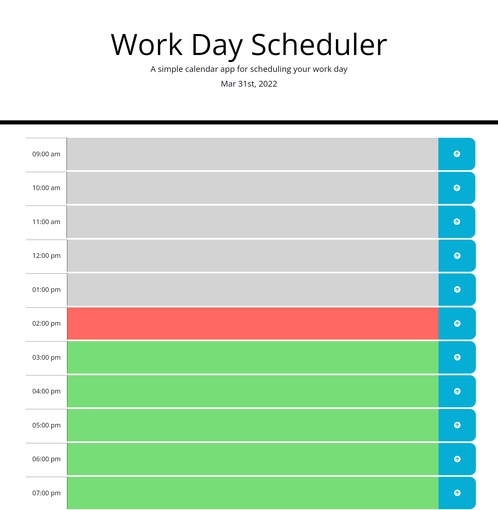
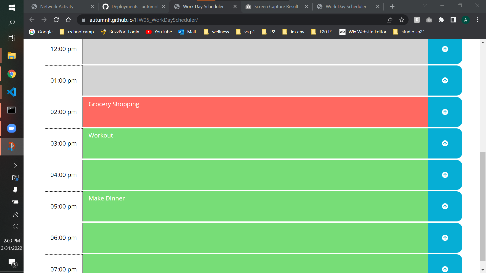

# HW05_WorkDayScheduler

**Link to deployed application:**
>https://autumnlf.github.io/HW05_WorkDayScheduler/

## Description
In this assignment I was given starter code that included a finished CSS file and incomplete HTML. The starting website contained a header and container to hold content (content to be coded as part of assignment). We are given the bare bones website and tasked with having it look and perform like a given .gif example. 
*   Site given:
    
    

*   Site to recreate:
    
    

The site needs to allow the user to add entries to their schedule per hour and be able to save their entry to local storage. This makes it so when leaving and refreshing the page, their entries will still be on the schedule. Additionally the schedule needs to be color-coded by the current hour. Each hour block should be color-coded to show if it is in the present, past, or future. 

## Screenshots:

